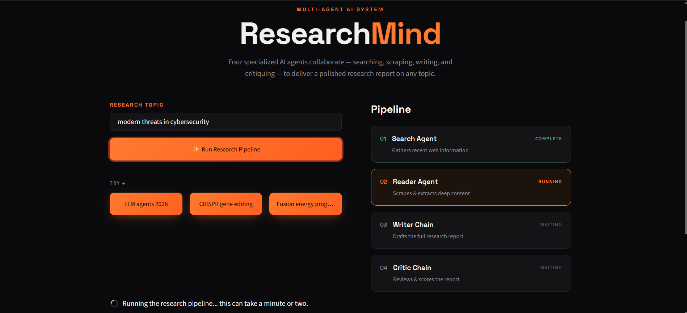

<div align="center">

# 🧠 ResearchMind

### Multi-Agent AI Research Assistant

**Search • Read • Write • Critique**

<p>
  
  
  
  
  
  
</p>

</div>

---

---

## 📌 Overview

**ResearchMind** is a multi-agent AI research assistant built with
**LangChain, Tavily, Ollama, Qwen2.5:3B, and Streamlit**.

Instead of relying on a single LLM call, the system divides the
research process into specialized stages:

```text
🔎 Search Agent
      ↓
📖 Reader Agent
      ↓
✍️ Writer Chain
      ↓
🧐 Critic Chain
      ↓
📄 Research Report
```
The application can search the web, extract deeper information from
URLs, generate a structured research report, and automatically review
and score the generated output.

The LLM runs locally using Ollama's Qwen2.5:3B model.

🖥️ Demo

A local multi-agent research pipeline running through a Streamlit UI.

⚙️ How It Works

🔎 Search Agent

    Uses Tavily to search the web and collect relevant, up-to-date sources for the given research topic.

📖 Reader Agent

    Processes the discovered URLs and extracts deeper information from the available web content.

✍️ Writer Chain

    Uses the collected research to generate a structured and detailed research report.

🧐 Critic Chain

    Reviews the generated report and provides an automatic evaluation and score.

🛠️ Tech Stack
```
| Technology    | Purpose                        |
| ------------- | ------------------------------ |
| 🐍 Python     | Core development               |
| 🔗 LangChain  | Agents, chains & orchestration |
| 🔎 Tavily     | Web search                     |
| 🦙 Ollama     | Local LLM runtime              |
| 🧠 Qwen2.5:3B | Open-source language model     |
| 🎨 Streamlit  | User interface                 |
```

📁 Project Structure
```
rsrch-ai-bot/
│
├── agents.py
├── pipeline.py
├── tools.py
├── requirements.txt
├── researchmind-demo.png
└── README.md
```

🚀 Getting Started
1. Clone the repository
```
git clone https://github.com/your-username/rsrch-ai-bot.git
cd rsrch-ai-bot
```
2. Install dependencies
```
pip install -r requirements.txt
```
3. Install the Ollama model
```
3. Install the Ollama model
```
4. Configure Tavily
Set your Tavily API key as an environment variable:
```
TAVILY_API_KEY=your_api_key_here
```
🔐 Never commit your API key to GitHub.

5. Run the application
```
streamlit run pipeline.py
```

📚 What I Learned

Building this project helped me understand:

      🤖 How AI Agents differ from simple LLM chains
      🔗 How to build multi-agent pipelines with LangChain
      🔎 How to create a web-search agent using Tavily
      📖 How to scrape and extract information from URLs
      ✍️ How Writer Chains generate structured reports
      🧐 How Critic Chains evaluate AI-generated output
      🔄 How agents share state through a pipeline
      🦙 How to run open-source LLMs locally with Ollama
      🎨 How to build an AI application with Streamlit
      🏗️ How to structure a real-world agentic AI project
      
🔮 Future Improvements

      📚 PDF and document research
      🔗 Automatic citations and source references
      🧠 Support for multiple local LLMs
      💾 Research history
      📄 Export reports to PDF/Markdown
      🔄 Iterative research and refinement

⚠️ Disclaimer

    ResearchMind is an educational project. AI-generated research may
    contain inaccurate or incomplete information. Always verify important
    information using the original sources.

<div align="center">
🧠 Search. Read. Write. Critique.

Built with Python, LangChain, Tavily, Ollama, Qwen2.5 & Streamlit.

⭐ If you found this project interesting, consider giving it a star!

</div> 


